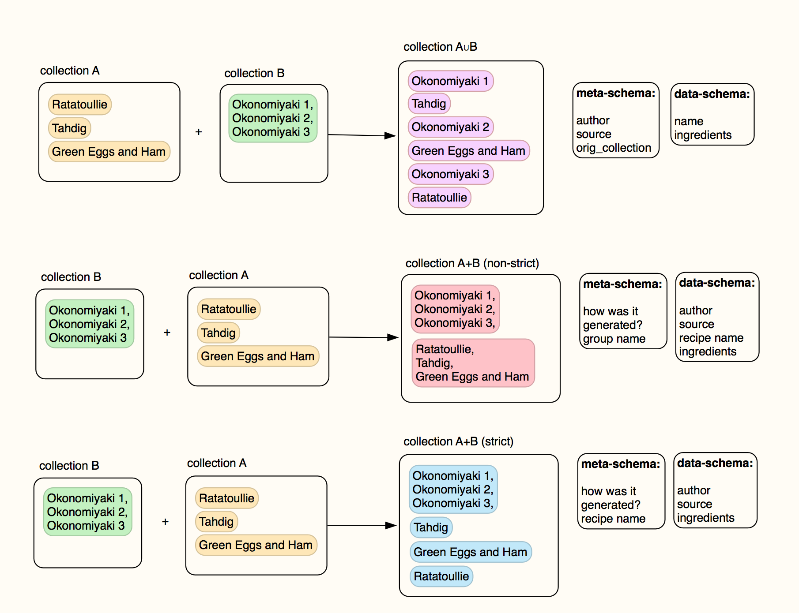

# Provenance Schema Examples

Example schemas in 'collection templates'. These examples explore 2 possible collection templates for a recipe-scraping scenario.

In both templates, each collection is composed of a set of named graphs, which form the basis for assertions. The data-schema `data.toml` describes the how the contents of each graph is structured; the meta-schema `meta.toml` describes the structure of the provenance metadata associated with each graph.

## `individual_recipes/`
Folder 

This scenario is a collection template where each named graph represents a single recipe. In this instance, the meta-schema captures information about the author and source of the recipe, while the data-schema captures details such as name and ingredients.

## `same_recipe/`

This scenario is for named graphs consisting of multiple versions of the same recipe, for example, 3 different versions of Okonomiyaki. In this instance, the meta-schema describes *how* each of these graphs was generated, while the source and authorship information is stored in the data-schema.

## merging collections

*correct this bit if you disagree*

Taking the `individual_recipes/` and `same_recipe/` templates as an example, how would the provevance file change if each of the `same_recipe/` graphs were separated into individual recipes?

Ordinarily, this transformation would be lossy, as the `individual_recipes` schema does not include a field for `source` and `author`. However, during the merge, the provenance structure of the graphs extracted from `same_recipes` is expanded, adding this information into the meta-schema.

Conversely, merging `individual_recipes/` into `same_recipes` would produce a second named graph, where the individual recipes are grouped by theme (or, if the relationship is strictly between recipes that are the same, it would make a new named graph for each separate recipe).

Visually, this would look like:

